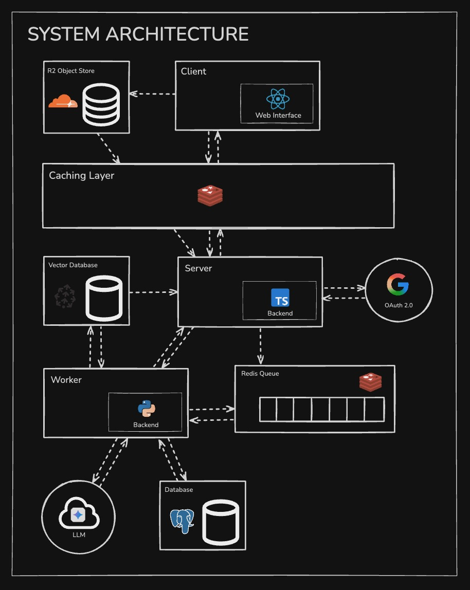

# **Legit.AI**
*Intelligently analyzing your legal documents with AI-powered precision*

---

## 📋 **Overview**

Legal Document Analyzer is an AI-powered SaaS platform that revolutionizes contract review for small businesses, freelancers, and individuals. Think of it as **"Grammarly for legal documents"** — but instead of fixing grammar, it identifies legal risks, suggests improvements, and makes complex contracts understandable without expensive lawyer fees.

> *"It's like having a smart lawyer assistant that reads your legal documents and tells you what's wrong with them."*

Whether you're reviewing NDAs, employment contracts, or terms of service, our platform transforms scary legal jargon into clear, actionable insights with professional-grade analysis accessible to everyone.

---

## 🎯 **Problem Statement**

Legal document review is expensive, time-consuming, and often inaccessible for small businesses and individuals. Most people:
- **Can't afford** professional legal review ($200-500+ per document)
- **Don't understand** complex legal language and clauses
- **Miss critical risks** that could be costly later
- **Lack expertise** to identify problematic terms or missing protections

Our solution democratizes legal analysis by providing instant, AI-powered contract review with the precision of a legal expert.

---

## 🚀 **Our Approach**

### **AI-First Legal Analysis**
We leverage **Google Gemini 2.5 Pro** combined with specialized legal prompting to:
1. **Parse & Classify** documents automatically
2. **Score** contracts using weighted parameters (5-6 per document type)
3. **Identify Risks** across liability, compliance, and enforceability
4. **Generate Suggestions** with prioritized improvements and one-click fixes

### **RAG-Powered Document Intelligence**
Our **Retrieval-Augmented Generation (RAG)** system enables:
- **Intelligent Chunking** of legal clauses
- **Vector-based Search** for precise context retrieval
- **Natural Language Queries** about specific document sections
- **Citation-backed Responses** with document references

### **Scalable Architecture**
Built with modern cloud-native technologies for:
- **Real-time Processing** with async job queues
- **Horizontal Scaling** across multiple workers
- **Cost Optimization** through efficient AI API usage
- **High Availability** with serverless deployment

---

## ✨ **Key Features**

### 🔍 **Document Analysis**
- **Multi-format Support**: Upload PDFs, Word docs, or text files
- **Auto-classification**: Intelligent document type detection
- **Comprehensive Scoring**: Overall grade (1-10) plus detailed section scores
- **Parameter-based Analysis**: Tailored evaluation for each contract type

### ⚠️ **Risk Detection**
- **Smart Risk Identification**: Highlights dangerous or problematic clauses
- **Severity Classification**: High / Medium / Low risk labeling
- **Compliance Checking**: Flags missing legal protections
- **Visual Highlighting**: Clear marking of concerning sections

### 💡 **Intelligent Suggestions**
- **Prioritized Recommendations**: Action items ranked by importance
- **One-click Improvements**: Instant fixes for common issues
- **Alternative Language**: AI-generated stronger clause suggestions
- **Before/After Comparisons**: Visual improvements preview

### 💬 **Document Chat Interface**
- **Natural Language Queries**: Ask questions in plain English
  - *"What happens if I quit without notice?"*
  - *"Is this non-compete clause enforceable?"*
- **Context-aware Responses**: Answers based on your specific document
- **Follow-up Suggestions**: Related questions and clarifications
- **Citation References**: Direct links to relevant document sections

### 📋 **Advanced Capabilities**
- **Batch Processing**: Analyze multiple documents simultaneously
- **Cross-document Comparison**: Identify inconsistencies across contracts
- **Document Editor**: Inline AI suggestions with change tracking
- **Version History**: Track document modifications over time
- **Multi-format Export**: Download improved documents in various formats

---

## 📚 **Supported Document Types**

| Document Type | Key Analysis Parameters |
|---|---|
| **NDAs** | Confidentiality scope, duration, exceptions, penalties |
| **Employment Contracts** | Termination clauses, non-compete, compensation, benefits |
| **Terms of Service** | Dispute resolution, liability limitations, user rights |
| **Software Licenses (EULAs)** | Usage rights, restrictions, warranty disclaimers |
| **Privacy Policies** | Data collection, sharing, retention, user controls |
| **Legal Demand Letters** | Claim validity, response requirements, escalation risks |

---

## 🛠️ **Tech Stack**

### **Frontend Stack**
- **React.js** with **TypeScript** for type-safe development
- **Tailwind CSS** for modern, responsive UI design
- **Cloudflare Pages** for fast, global content delivery

### **Backend Stack**
- **Express.js** with **TypeScript** for robust API development
- **Vercel Functions** for serverless, auto-scaling deployment
- **Upstash Redis** for job queuing and caching

### **Database & Storage**
- **Neon PostgreSQL** with **pgvector** for vector operations
- **Cloudflare R2** for scalable file storage
- **Prisma ORM** for type-safe database operations

### **AI/ML Stack**
- **Google Gemini 2.5 Pro** for advanced legal analysis
- **OpenAI Embeddings** (text-embedding-ada-002) for document vectorization
- **LangChain** for RAG pipeline orchestration
- **pgvector** for efficient similarity search

---

## 🏗️ **System Architecture**

<div align="center">
  
</div>

### **Core Processing Pipeline**

```
Upload → Parse → Extract → Analyze → Store
   ↓        ↓       ↓        ↓       ↓
  PDF    Extract  Chunk   Score   Vector
 DOCX     Text    Text   Clauses   Store
 TXT    Structure Embed  Generate    DB
```

### **RAG Chat Flow**

```
User Query → Vector Search → Context Retrieval → LLM Generation → Response
     ↓              ↓              ↓              ↓            ↓
  Embed Query   Find Similar   Relevant Chunks   AI Analysis  Cited Answer
```

## 🎯 **Success Metrics**

| Metric | Target | Description |
|---|---|---|
| **Analysis Accuracy** | 85%+ | User confidence in document scores |
| **Response Time** | <5 seconds | Average analysis completion time |
| **Chat Relevance** | 90%+ | Quality of document Q&A responses |
| **User Retention** | 60%+ | Monthly active user retention rate |

---


## **Prerequisites**

### 
- Node.js (v18 or higher)
- npm/yarn package manager
- PostgreSQL with pgvector extension
- API keys for Gemini and OpenAI


